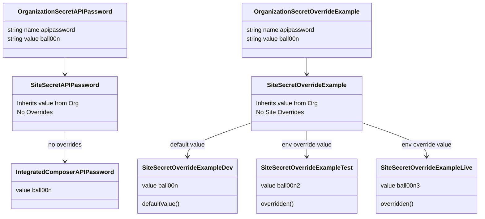

# Terminus Secrets Manager Plugin

Pantheon’s Secrets Manager Terminus plugin is key to maintaining industry best practices for secure builds and application implementation. Secrets Manager provides a convenient mechanism for you to manage your secrets and API keys directly on the Pantheon platform.

## Table of Contents

- [Overview](#overview)
  * [Key Features](#key-features)
  * [Early Access](#early-access)
- [Concepts](#concepts)
  * [Secret](#secret)
  * [Secret type](#secret-type)
  * [Secret scope](#secret-scope)
- [Plugin Usage](#plugin-usage)
  * [Secrets Manager Plugin Requirements](#secrets-manager-plugin-requirements)
  * [Installation](#installation)
  * [Quick Start](#quick-start)
  * [Site secrets Commands](#site-secrets-commands)
  * [Help](#help)
- [Rate Limiting](#rate-limiting)
- [Use Secrets with Integrated Composer](#use-secrets-with-integrated-composer)
  * [Mechanism 1: Oauth Composer authentication](#mechanism-1-oauth-composer-authentication)
  * [Mechanism 2: HTTP Basic Authentication](#mechanism-2-http-basic-authentication)
- [Using Secrets in Your Site Code](#using-secrets-in-your-site-code)
  * [Using pantheon_get_secret()](#using-pantheon_get_secret)
  * [Using the Customer Secrets PHP SDK](#using-the-customer-secrets-php-sdk)
- [Use Secrets in Drupal through the Key module](#use-secrets-in-drupal-through-the-key-module)
- [Advanced Topics](#advanced-topics)
  * [Organization-owned secrets](#organization-owned-secrets)
  * [Environment overrides](#environment-overrides)
  * [The life of a secret](#the-life-of-a-secret)
  * [Secret inheritance diagram](#secret-inheritance-diagram)
  * [Organization secrets Commands](#organization-secrets-commands)


## Overview

### Key Features

- Securely host and maintain secrets on Pantheon

- Create and update secrets via Terminus

- Use private repositories in Integrated Composer builds

- Ability to set a `COMPOSER_AUTH` environment variable and/or a Composer `auth.json` authentication file with Terminus commands

- Ability to define site and org ownership of secrets

- Propagate organization-owned secrets to all the sites in the org

- Ability to define the degree of secrecy for each managed item

- Secrets are encrypted at rest

### Early Access

The Secrets Manager plugin is available for Early Access participants. Features for Secrets Manager are in active development. Pantheon's development team is rolling out new functionality often while this product is in Early Access. Visit the [Pantheon Slack channel](https://slackin.pantheon.io/) (or sign up for the channel if you don't already have an account) to learn how you can enroll in our Early Access program. Please review [Pantheon's Software Evaluation Licensing Terms](https://legal.pantheon.io/#contract-hkqlbwpxo) for more information about access to our software.

## Concepts

### Secret

A key-value pair that should not be exposed to the general public, typically something like a password, API key, or the contents of a peer-to-peer cryptographic certificate. SSL certificates that your site uses to serve pages are out of scope of this process and are managed by the dashboard in a different place. See the documentation for SSL certificates for details.

### Secret type

This is a field on the secret record. It defines the usage for this secret and how it is consumed. Current types are:

- `runtime`: this secret will be used to retrieve it in application runtime using the `pantheon_get_secret()` function or the Customer Secrets PHP SDK. This is the recommended way to set information like API keys for third-party integrations in your application.

- `env`: this secret will be used to set environment variables in the application runtime. This type is not yet in use in Early Access.

- `composer`: this secret type is used for composer authentication to private packages.

- `file`: this type allows you to store files in the secrets. This type is not yet in use in Early Access.

Note that you can only set one type per secret and this cannot be changed later (unless you delete and recreate the secret).

### Secret scope

This is a field on the secret record. It defines the components that have access to the secret value. You can set multiple scopes per secret (for example, `--scope=web,user`), but scopes cannot be changed after creation. To change scopes, you must delete and recreate the secret.

| Scope | Makes secret accessible to | When to use |
|-------|----------------------------|-------------|
| `web` | Your site's PHP code via `pantheon_get_secret()` | API keys, credentials, runtime secrets |
| `ic` | Integrated Composer builds | Private repository authentication |
| `user` | Terminus commands (allows you to read the value back) | When you need to retrieve the secret value later via `terminus secret:site:list` |

**Common scope combinations:**
- `--scope=web,user`: API keys you want to use in code AND view later in Terminus
- `--scope=ic,user`: Private repository credentials you want to view later
- `--scope=web`: API keys you never need to read back (most secure)

**Note:** For information about organization-wide secrets and environment-specific overrides, see the [Advanced Topics](#advanced-topics) section.

## Plugin Usage

### Secrets Manager Plugin Requirements

Secrets Manager requires the following:

- A Pantheon account
- A site that uses [Integrated Composer](https://docs.pantheon.io/guides/integrated-composer) and runs PHP >= 8.0
- Terminus 3.0+

### Installation

Terminus 3.x has built in plugin management.

Run the command below to install Terminus Secrets Manager.

```
terminus self:plugin:install terminus-secrets-manager-plugin
```

### Quick Start

The most common use case is storing API keys or credentials and using them in your site code. Here's how to do it:

**Step 1: Store your secret**

```bash
terminus secret:site:set my-site sendgrid-api-key "SG.abc123xyz..." --type=runtime --scope=web,user
```

**Step 2: Use it in your PHP code**

```php
// The pantheon_get_secret() function is automatically available
$api_key = pantheon_get_secret('sendgrid-api-key');

// Use it in your application
$sendgrid = new \SendGrid($api_key);
```

**Step 3: Verify your secret was stored**

```bash
terminus secret:site:list my-site
```

That's it! Your secret is now encrypted at rest and accessible only to your site's code.

**Notes:**
- Use `--scope=web` to make secrets accessible in your site code
- Add `user` scope if you want to retrieve the secret value via Terminus later
- Secrets are cached for up to 15 minutes

### Site secrets Commands

#### Set a secret

The secrets `set` command takes the following format:

- `Name`
- `Value`
- `Type`
- `One or more scopes`


**Examples:**

```bash
# Set an API key for use in site code
terminus secret:site:set my-site stripe-api-key "sk_live_abc123..." --type=runtime --scope=web,user
```

```bash
# Set a GitHub token for private Composer repositories
terminus secret:site:set my-site github-oauth.github.com "ghp_abc123..." --type=composer --scope=ic,user
```

```bash
# Set a file secret
terminus secret:site:set my-site credentials.json '{"key": "value"}' --type=file --scope=web
```

**Default behavior:** If you do not include `--type` or `--scope` flags, they default to `runtime` and `user` respectively.

**Update an existing secret:**

```bash
# Update the value (type and scope cannot be changed)
terminus secret:site:set my-site stripe-api-key "sk_live_new_value..."
```

Note: When updating an existing secret, do NOT pass `--type` or `--scope` flags, as these fields are immutable. To change type or scope, delete and recreate the secret.

**Set an environment-specific override:**

```bash
# Use a sandbox API key in dev, production key in live
terminus secret:site:set my-site.dev sendgrid-api-key "SG.sandbox_key..."
terminus secret:site:set my-site.live sendgrid-api-key "SG.production_key..."
```

Note: You can only add an environment override to an existing secret. Create the base secret first.


#### List secrets

The secrets `list` command provides a list of all secrets available for a site. The following fields are available:

- `Secret name`
- `Secret scopes`
- `Secret type`
- `Secret value`
- `Environment override values`
- `Org values`

Note that the `value` field will contain a placeholder value unless the `user` scope was specified when the secret was set.

**Examples:**

```bash
# List all secrets for a site (basic view)
terminus secret:site:list my-site
```

Output:
```
 ------------------- ------------- ---------------------------
  Secret name         Secret type   Secret value
 ------------------- ------------- ---------------------------
  stripe-api-key      runtime       sk_live_abc123...
  github-oauth...     composer      ***
  sendgrid-api-key    runtime       ***
 ------------------- ------------- ---------------------------
```

```bash
# List with all fields (including overrides and org inheritance)
terminus secret:site:list my-site --fields="*"
```

Output:
```
 ------------------- ------------- ----------------- --------------- ----------------------------- --------------------
  Secret name         Secret type   Secret value      Secret scopes   Environment override values   Org values
 ------------------- ------------- ----------------- --------------- ----------------------------- --------------------
  stripe-api-key      runtime       sk_live_abc...    web, user
  github-oauth...     composer      ***               ic, user
  sendgrid-api-key    runtime       ***               web, user       live=SG.prod_key...
 ------------------- ------------- ----------------- --------------- ----------------------------- --------------------
```

Note: The `value` field shows `***` unless the secret has `user` scope.

#### Delete a secret

The secrets `delete` command will remove a secret and all of its overrides.

**Examples:**

```bash
# Delete a secret entirely
terminus secret:site:delete my-site stripe-api-key
```

```bash
# Delete only an environment-specific override
terminus secret:site:delete my-site.live sendgrid-api-key
```

Note: Deleting the base secret removes all environment overrides. Deleting an environment override leaves the base secret intact.

#### Generate file for local development

The secrets `local-generate` command will generate a json file useful for local development emulation of secrets.

**Example:**

```bash
terminus secret:site:local-generate my-site --filepath=./secrets.json
```

Output:
```
[notice] Secrets file written to: ./secrets.json. Please review this file and adjust accordingly for your local usage.
```

This generates a JSON file with your secrets for local development. See the [SDK documentation](https://github.com/pantheon-systems/customer-secrets-php-sdk) for how to use this file with Lando or other local environments.

### Help

Run `terminus list secret` for a complete list of available commands. Use terminus help <command> to get help with a specific command.

## Rate Limiting

The service supports up to 3 requests per second per user through Terminus. If you hit that limit, the API will return a `429` error code and the plugin will throw an error.

The PHP SDK and `pantheon_get_secret()` function are not affected by this rate limiting.

## Use Secrets with Integrated Composer

You must configure your private repository and provide an authentication token before you can use the Secrets Manager Terminus plugin with Integrated Composer. You could use either of the following mechanisms to setup this authentication.


### Mechanism 1: Oauth Composer authentication

#### GitHub Repository

1. [Generate a Github token](https://docs.github.com/en/authentication/keeping-your-account-and-data-secure/creating-a-personal-access-token). The Github token must have all "repo" permissions selected.

    NOTE: Check the repo box that selects all child boxes. **Do not** check all child boxes individually as this does not set the correct permissions.

     

1. Set the secret value to the token via terminus:
   ```bash
   terminus secret:site:set my-site github-oauth.github.com "ghp_abc123..." --type=composer --scope=user,ic
   ```

1. Add your private repository to the `repositories` section of `composer.json`:

    ```json
    {
        "type": "vcs",
        "url": "https://github.com/your-organization/your-repository-name"
    }
    ```

    Your repository should contain a `composer.json` that declares a package name in its `name` field. If it is a WordPress plugin or a Drupal module, it should specify a `type` of `wordpress-plugin` or `drupal-module` respectively. For these instructions, we will assume your package name is `your-organization/your-package-name`.

1. Require the package defined by your private repository's `composer.json` by either adding a new record to the `require` section of the site's `composer.json` or with a `composer require` command:

    ```bash
    composer require your-organization/your-package-name
    ```

1. Commit your changes and push to Pantheon.

#### GitLab Repository

1. [Generate a GitLab token](https://docs.gitlab.com/ee/user/profile/personal_access_tokens.html). Ensure that `read_repository` scope is selected for the token.

1. Set the secret value to the token via Terminus:
   ```bash
   terminus secret:site:set my-site gitlab-oauth.gitlab.com "glpat-abc123..." --type=composer --scope=user,ic
   ```

1. Add your private repository to the `repositories` section of `composer.json`:

    ```json
    {
        "type": "vcs",
        "url": "https://gitlab.com/your-group/your-repository-name"
    }
    ```

    Your repository should contain a `composer.json` that declares a package name in its `name` field. If it is a WordPress plugin or a Drupal module, it should specify a `type` of `wordpress-plugin` or `drupal-module` respectively. For these instructions, we will assume your package name is `your-organization/your-package-name`.

1. Require the package defined by your private repository's `composer.json` by either adding a new record to the `require` section of the site's `composer.json` or with a `composer require` command:

    ```bash
    composer require your-group/your-package-name
    ```

1. Commit your changes and push to Pantheon.

#### Bitbucket Repository

1. [Generate a Bitbucket oauth consumer](https://support.atlassian.com/bitbucket-cloud/docs/use-oauth-on-bitbucket-cloud/). Ensure that Read repositories permission is selected for the consumer. Also, set the consumer as private and put a (dummy) callback URL.

1. Set the secret value to the consumer info via Terminus:
   ```bash
   terminus secret:site:set my-site bitbucket-oauth.bitbucket.org "consumer_key consumer_secret" --type=composer --scope=user,ic
   ```

1. Add your private repository to the `repositories` section of `composer.json`:

    ```json
    {
        "type": "vcs",
        "url": "https://bitbucket.org/your-organization/your-repository-name"
    }
    ```

    Your repository should contain a `composer.json` that declares a package name in its `name` field. If it is a WordPress plugin or a Drupal module, it should specify a `type` of `wordpress-plugin` or `drupal-module` respectively. For these instructions, we will assume your package name is `your-organization/your-package-name`.

1. Require the package defined by your private repository's `composer.json` by either adding a new record to the `require` section of the site's `composer.json` or with a `composer require` command:

    ```bash
    composer require your-organization/your-package-name
    ```

1. Commit your changes and push to Pantheon.

### Mechanism 2: HTTP Basic Authentication

You may create a `COMPOSER_AUTH json` and make it available via the `COMPOSER_AUTH` environment variable if you have multiple private repositories on multiple private domains.

Composer has the ability to read private repository access information from the environment variable: `COMPOSER_AUTH`. The `COMPOSER_AUTH` variables must be in a [specific JSON format](https://getcomposer.org/doc/articles/authentication-for-private-packages.md#http-basic). 

Format example:

```bash
#!/bin/bash

read -e COMPOSER_AUTH_JSON <<< {
    "http-basic": {
        "github.com": {
            "username": "my-username1",
            "password": "my-secret-password1"
        },
        "repo.example2.org": {
            "username": "my-username2",
            "password": "my-secret-password2"
        },
        "private.packagist.org": {
            "username": "my-username2",
            "password": "my-secret-password2"
        }
    }
}
EOF

`terminus secret:site:set ${SITE_NAME} COMPOSER_AUTH ${COMPOSER_AUTH_JSON} --type=env --scope=user,ic`
```

## Using Secrets in Your Site Code

Once you've set secrets with the `runtime` type and `web` scope, you can retrieve them in your site's PHP code.

### Using pantheon_get_secret()

The simplest way to access secrets is with the `pantheon_get_secret()` function, which is automatically available in all Pantheon environments—no includes or dependencies required.

**Example usage:**

```php
// Retrieve a secret value
$api_key = pantheon_get_secret('my-api-key');

// Use the secret in your application
$client = new ThirdPartyApiClient($api_key);
```

**Important:** Secrets must have `web` scope to be accessible via `pantheon_get_secret()`. Set secrets with the appropriate scope:

```bash
terminus secret:site:set <site> my-api-key "<value>" --type=runtime --scope=web
```

Note: If you want to be able to retrieve the secret value later via Terminus, add `user` scope:

```bash
terminus secret:site:set <site> my-api-key "<value>" --type=runtime --scope=web,user
```

### Using the Customer Secrets PHP SDK

For more advanced features, including local development support, use the [Customer Secrets PHP SDK](https://packagist.org/packages/pantheon-systems/customer-secrets-php-sdk). This is a separate Composer package that provides additional functionality beyond the basic `pantheon_get_secret()` function.

**Installation:**

```bash
composer require pantheon-systems/customer-secrets-php-sdk
```

**Example usage:**

```php
use PantheonSystems\CustomerSecrets\CustomerSecrets;

$client = CustomerSecrets::create()->getClient();
$secret = $client->getSecret('my-api-key');
$secret_value = $secret->getValue();

// Or get all secrets at once
$secrets = $client->getSecrets();
```

**Local development:** The SDK includes a fake client implementation for local development. Generate a local secrets file with:

```bash
terminus secret:site:local-generate <site> --filepath=./secrets.json
```

Then configure your local environment to use it. See the [SDK documentation](https://github.com/pantheon-systems/customer-secrets-php-sdk) for detailed local setup instructions, including examples for Lando and other development environments.

**Note:** Secrets are cached for up to 15 minutes. If you modify a secret, allow up to 15 minutes for the change to take effect in your application.

## Use Secrets in Drupal through the Key module

If you want to use Pantheon Secrets in your Drupal application through the [Key module](https://www.drupal.org/project/key), you should use the [Pantheon Secrets](https://www.drupal.org/project/pantheon_secrets) module.

## Advanced Topics

### Organization-owned secrets

Organization secrets allow you to set a secret once at the organization level and have it automatically inherited by all sites owned by that organization. This is useful for sharing common credentials across multiple sites.

**Key points:**
- Organization secrets apply to ALL sites owned by the organization
- Site-level secrets with the same name will override organization secrets
- Secrets from Supporting Organizations do not apply (only Owner organization secrets)
- Organization secrets use the same type and scope rules as site secrets

See the [Organization Secrets Commands](#organization-secrets-commands) section below for usage details.

### Environment overrides

Environment overrides allow you to set different values for a secret in different Pantheon environments (dev, test, live, multidev). For example, you might want to use a sandbox API key in dev and test, but a production API key in live.

**Key points:**
- You can only create an override for an existing secret (create the base secret first)
- Environment overrides work for both site-owned and organization-owned secrets
- To delete an override, use the delete command with the environment specified
- Type and scope cannot be changed with overrides

**Important:** Due to platform design, Integrated Composer always runs in `dev` or multidev environments, never in `test` or `live`. Therefore, environment overrides are not recommended for Composer authentication. The primary use case is for runtime secrets that need different values between live and non-live environments.

### The life of a secret

When your application or Integrated Composer fetches secrets, the following process occurs:

1. Fetch secrets for the site with the requested type and scopes
2. Apply environment overrides (if any) based on the current environment
3. If the site is owned by an organization:
   - Fetch the organization secrets with the requested type and scopes
   - Apply environment overrides (if any) to organization secrets
   - Merge organization secrets with site secrets (site secrets take precedence)
4. Make the resulting secrets available to the requesting runtime

**Example scenario:**

You have a site `my-site` owned by organization `my-org`, and another site `personal-site` owned by your personal account.

When Integrated Composer runs for `personal-site`:
- Fetches site secrets with scope `ic`
- Applies environment overrides for current environment
- No organization secrets to merge (personal account)
- Provides secrets to Composer

When Integrated Composer runs for `my-site`:
- Fetches site secrets with scope `ic`
- Applies environment overrides for current environment
- Fetches organization `my-org` secrets with scope `ic`
- Applies environment overrides to organization secrets
- Merges both (site secrets win if there are duplicates)
- Provides merged secrets to Composer

### Secret inheritance diagram



### Organization secrets Commands

#### Set a secret

The organization secrets `set` command takes the following format:

- `Organization name or UUID`
- `Name`
- `Value`
- `Type`
- `One or more scopes`

**Run the command below to set a new secret in Terminus:**

```bash
terminus secret:org:set <org> <secret-name> <secret-value>
```

```bash
terminus secret:org:set <org> file.json "{}" --type=file
```

```bash
terminus secret:org:set <org> <secret-name> --scope=user,ic
```

Note: If you do not include a `type` or `scope` flag, their defaults will be `runtime` and `user` respectively.

**Run the command below to update an existing secret in Terminus:**

```bash
terminus secret:org:set <org> <secret-name> <secret-value>
```

Note: When updating an existing secret, `type` and `scope` should NOT be passed as they are immutable. You should delete and recreate the secret if you need to update those properties.

**Add or update an environment override for an existing secret in Terminus:**

```bash
terminus secret:org:set --env=<env> <org> <secret-name> <secret-value>
```

Note: You can add an environment override only to existing secrets; otherwise, it will fail.

#### List secrets

The secrets `list` command provides a list of all secrets available for an organization. The following fields are available:

- `Secret name`
- `Secret scopes`
- `Secret type`
- `Secret value`
- `Environment override values`

Note that the `value` field will contain a placeholder value unless the `user` scope was specified when the secret was set.

**Run the command below to list an organization's secrets:**

```bash
terminus secret:org:list <org>
```

```bash
terminus secret:org:list <org> --fields="*"
```

#### Delete a secret

The secrets `delete` command will remove a secret and all of its overrides.

**Run the command below to delete a secret:**

```bash
terminus secret:org:delete <org> <secret-name>
```

**Run the command below to delete an environment override for a secret:**

```bash
terminus secret:org:delete --env=<env> <org> <secret-name>
```
